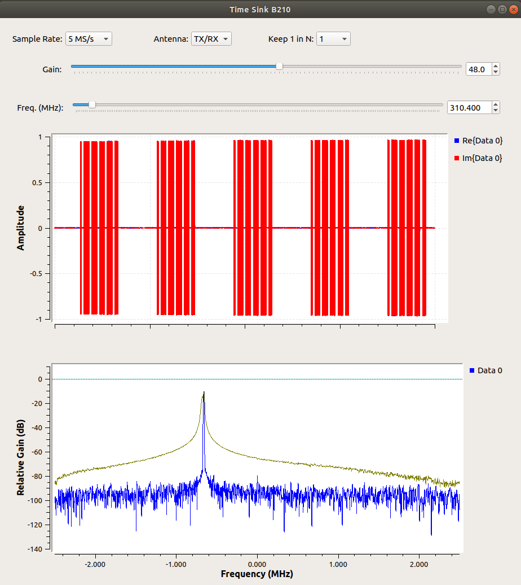

# gr-garage_door

This GNU Radio out-of-tree module simulates signals for a Stanley ST500W (310 MHz, 10 DIP switch) garage door opener. This is an older model (pre-1982) and utilizes on-off keying (OOK) to repeat the same message for every button press. 

This software has been integrated into [FISSURE: The RF Framework](https://github.com/ainfosec/FISSURE).

# Examples

The Garage Door Transmit .grc will simulate a button press and repeat indefinitely.
  - DIP Positions are the values for the ten switches on the remote and garage door opener
  - Press Duration simulates the button on the remote being held down
  - Press Repetition Interval is the amount of time between button presses
  
The Garage Door Cycle .grc will rapidly cycle through all the DIP switch positions and wrap around on repeat.
  - DIP Interval is the time between the start of two messages
  - Starting DIP is the initial DIP switch value
  - Bursts per DIP specifies the number of repeating messages in an interval
  - Burst interval is the time between two DIP values. The code needs to be updated to make the timing exact.
  

