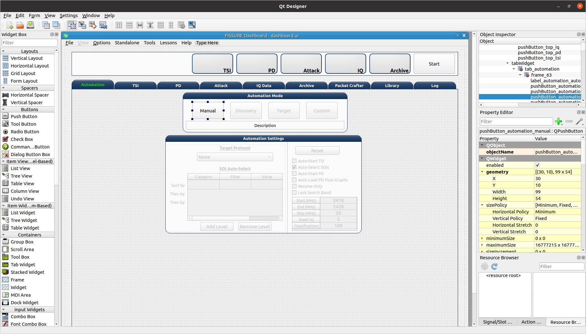

# Modifying Dashboard
This guide will provide examples on how to add GUI elements to the FISSURE Dashboard and interact with those elements within the Dashboard.py code.

## Table of Contents
1. [QtDesigner](#qtdesigner)
2. [dashboard.py](#dashboard)

## QtDesigner

<div id="qtdesigner"/> 

Launch QtDesigner with the `designer` command and open the _FISSURE/UI/dashboard.ui_ file.



### Creating New Widgets
Frequently used widgets:
- Push Button
- Text Edit
- Combo Box
- Check Box
- Label
- Frame
- Spin Box
- Double Spin Box
- Horizontal Slider
- Table Widget
- Tab Widget
- Stacked Widget
- Tree Widget
- Group Box
- Progress Bar
- List Widget

Drag widgets onto the Dashboard and modify their property values in the Property Editor. 

It is suggested to use an objectName consistent with the FINDINGS naming convention: _widget-type_tab-location_description_ (e.g. pushButton_automation_manual, textEdit_iq_timeslot_input)

Menu items can be added by clicking "Type Here" in any of the menus/submenus and entering text. Separators can be added by clicking "Add Separator" and then dragged or by right clicking and clicking "Insert Separator". Submenus can be added by clicking the right side of any menu item.

### Styling Widgets
Many labels and frames use stylesheets. Stylesheets can be applied to all widgets sharing the same type or only to specific widgets. Each widget has their own unique properties that can be customized. If possible, avoid setting the stylesheets in the _dashboard.py_ code to better manage and organize the stylesheets.

Tab Widget Example 1:
```
#tabWidget > QTabBar::tab {
	width: 132px; 
	height:27px;
	margin-top: 0px;
}

#tabWidget > QTabBar::tab:!selected {
	margin-top: 6px;
	height: 21px;
	width: 132px; 
}

QTabBar::tab:disabled {
	background-color: qlineargradient(spread:pad, x1:0, y1:0, x2:0, y2:1, stop:0 #eeeeee, stop:0.12 #888888, stop:0.3 #666666,   stop:0.85 #444444, stop:1 #444444);
	border: 1px solid #444444;
	color: rgb(150, 150, 150);
}

QTabWidget::pane { 
	border: 1px solid #17365D;
}

QTabBar::tab {
	qproperty-alignment: AlignCenter;
	border-top-left-radius: 15px;
	border-top-right-radius: 15px;
	background-color: qlineargradient(spread:pad, x1:0, y1:0, x2:0, y2:1, stop:0 #e7eaee, stop:0.12 #455e7d, stop:0.3 #2e4a6d,   stop:0.85 #17365D, stop:1 #17365D);
	border: 1px solid #17365D;
	color:rgb(0, 220, 0);
	font: bold 10pt "Ubuntu";
	margin-right:1px;
	width: 132px;
	height:22px;
	margin-top: 3px;
}

QTabBar::tab:!selected {
	margin-top: 7px;
	height: 18px;
	color: rgb(255, 255, 255);
}
```

Tab Widget Example 2:
```
#tabWidget_3 > QTabBar::tab{width:110px}
```

Label Example 1:
```
QLabel#label_294 {
	qproperty-alignment: AlignCenter;
	border: 1px solid #17365D;
	border-top-left-radius: 15px;
	border-top-right-radius: 15px;
	background-color: qlineargradient(spread:pad, x1:0, y1:0, x2:0, y2:1, stop:0 #e7eaee, stop:0.12 #455e7d, stop:0.3 #2e4a6d,   stop:0.85 #17365D, stop:1 #17365D);
	padding: 0px 0px;
	color: rgb(255, 255, 255);
	max-height: 20px;
	font: bold 10pt "Ubuntu";
}
```

Frame Example 1:
```
QFrame#frame_9 {
	background-color: rgb(251, 251, 251);
	border: 1px solid #17365D;
	border-bottom-left-radius: 15px;
	border-bottom-right-radius: 15px;
}
```

Push Button Example 1:
```
#pushButton_top_tsi{
	color: rgb(0, 0, 0,);
	padding: 45px 0px 0px 92px;
	background-color: qradialgradient(cx: 0.3, cy: -0.4, fx: 0.3, fy: -0.4, radius: 1.35, stop: 0 rgba(255, 255, 255,50), stop: 1 rgba(100, 100, 100,50));
	border-style: outset;
	border-width: 2px;
	border-radius: 10px;
	/*border-color: #152947;*/
	border-color:  #17365D;
}

#pushButton_top_tsi:hover{
	background-color: qradialgradient(cx: 0.3, cy: -0.4, fx: 0.3, fy: -0.4, radius: 1.35, stop: 0 rgba(255, 255, 255,50), stop: 1 rgba(170, 170, 170,50));
}

#pushButton_top_tsi:pressed{
	background-color: qradialgradient(cx: 0.3, cy: -0.4, fx: 0.3, fy: -0.4, radius: 1.35, stop: 0 rgba(255, 255, 255,50), stop: 1 rgba(100, 100, 100,50));	
	padding: 47px -2px 0px 92px;
}
```


## dashboard.py

<div id="dashboard"/> 

Any widget in the Dashboard can be referenced with `self.objectName`.

The following are frequently called public functions for the widgets in FISSURE:

```
# Push Button
self.pushButton_name.text()
self.pushButton_name.setText("Text")
self.pushButton_name.setEnabled(False)
self.pushButton_name.setVisible(True)

# Text Edit
str(self.textEdit_name.toPlainText())
self.textEdit_name.setPlainText("Text")

# Combo Box
str(self.comboBox_name.currentText())
self.comboBox_name.clear()
self.comboBox_name.addItem(get_dissector)
self.comboBox_name.addItems(get_packet_types)
self.comboBox_name.setCurrentIndex(0)
self.comboBox_name.currentIndex(0)

# Check Box
self.checkBox_name.isChecked()
self.checkBox_name.setChecked(False)

# Label
self.label_name.text()
self.label_name.setText(get_samples)
self.label_name.setPixmap(QtGui.QPixmap(os.path.dirname(os.path.realpath(__file__)) + "/Icons/USRP_X310.png")) 

# Frame
self.frame_name.pos()
self.frame_name.geometry()

# Spin Box/Double Spin Box
self.spinBox_name.value()
self.spinBox_name.setValue(10)
self.spinBox_name.setMaximum(35)
self.spinBox_name.setMinimum(0)

# Horizontal/Vertical Slider
self.horizontalSlider_name.setMinimum(int(win_min))
self.horizontalSlider_name.setMaximum(int(win_max))
self.horizontalSlider_name.setValue(int(win_min)) 
self.horizontalSlider_name.setSliderPosition(2)

# Table Widget
self.tableWidget_name.rowCount()
self.tableWidget_name.columnCount()
self.tableWidget_name.setColumnCount(1)
self.tableWidget_name.setRowCount(0)
self.tableWidget_name.removeRow(1)
self.tableWidget_name.removeColumn(5)
self.tableWidget_name.insertRow(0)
self.tableWidget_name.currentRow() 
self.tableWidget_name.clearContents()
self.tableWidget_name.resizeRowsToContents()                   
self.tableWidget_name.resizeColumnsToContents()    
self.tableWidget_name.setColumnWidth(4,130)
self.tableWidget_name.horizontalHeader().setResizeMode(2,QtGui.QHeaderView.Stretch)  
self.tableWidget_name.horizontalHeader().setStretchLastSection(True)                
self.tableWidget_name.verticalHeaderItem(0).text()
self.tableWidget_name.setHorizontalHeaderItem(1,QtGui.QTableWidgetItem(""))
self.tableWidget_name.item(0,5).text()
self.tableWidget_name.setCurrentCell(self.tableWidget_name.currentRow()-1,0)
table_item = self.tableWidget_name.takeItem(self.tableWidget_name.currentRow()-1,0)
table_item = QtGui.QTableWidgetItem(str(657))  # from PyQt4 import QtCore, QtGui, uic
table_item.setTextAlignment(QtCore.Qt.AlignCenter)
table_item.setFlags(table_item.flags() & ~QtCore.Qt.ItemIsEditable)
self.tableWidget_name.setItem(0,0,table_item) 
self.tableWidget_name.item(row,4).setFlags(self.tableWidget_name.item(row,4).flags() ^ QtCore.Qt.ItemIsEnabled)
self.tableWidget_name.cellWidget(0,4).currentText()
self.tableWidget_name.cellWidget(1,0).isChecked()
self.tableWidget_name.cellWidget(row,0).isEnabled()
self.tableWidget_name.cellWidget(row,0).setCurrentIndex(1)
self.tableWidget_name.setCellWidget(0,0,new_button)                

new_checkbox = QtGui.QCheckBox("",self)
new_checkbox.setStyleSheet("margin-left:17%")
self.tableWidget_name.setCellWidget(n,0,new_checkbox)

new_pushbutton = QtGui.QPushButton(self.table_list[n])
new_pushbutton.setText("Guess")
new_pushbutton.setFixedSize(64,23)
self.tableWidget_name.setCellWidget(self.tableWidget_name.rowCount()-1,1,new_pushbutton)
new_pushbutton.clicked.connect(lambda: self._slotGuessInterfaceTableClicked(get_value))

# Tab Widget
self.tabWidget_name.currentIndex()
self.tabWidget_name.setCurrentIndex(4)
self.tabWidget_name.tabText(self.tabWidget_name.currentIndex())
self.tabWidget_name.setTabText(0,"Detector")
self.tabWidget_name.setTabToolTip(1,"Target Signal Identification")
self.tabWidget_name.setTabEnabled(2,False)
self.tabWidget_name.count()
self.tabWidget_name.removeTab(1)
new_tab = QtGui.QWidget()       
vBoxlayout  = QtGui.QVBoxLayout()
vBoxlayout.addWidget(self.table_name)
new_tab.setLayout(vBoxlayout)   
self.tabWidget_name.addTab(new_tab,"text")  
get_table = self.tabWidget_name.children()[0].widget(n).children()[1]  # TabWidget>>StackedLayout>>Tab>>Table

# Stacked Widget
self.stackedWidget_name.currentIndex()
self.stackedWidget_name.setCurrentIndex(1)
self.stackedWidget_name.count()

# Tree Widget
self.treeWidget_name.currentItem().text(0) 
self.treeWidget_name.setCurrentItem(self.treeWidget_name.topLevelItem(0))
new_item = QtGui.QTreeWidgetItem()
new_item.setText(0,"text")
new_item.setDisabled(True)
self.treeWidget_name.addTopLevelItem(new_item)
self.treeWidget_name.clear()
self.treeWidget_name.setHeaderLabel("text")
self.treeWidget_name.invisibleRootItem()  
self.treeWidget_name.collapseAll()   
self.treeWidget_name.expandAll() 
self.treeWidget_name.findItems("text",QtCore.Qt.MatchExactly|QtCore.Qt.MatchRecursive,0)[0].setDisabled(False)
self.treeWidget_name.findItems("text",QtCore.Qt.MatchExactly|QtCore.Qt.MatchRecursive,0)[0].setHidden(False)
iterator = QtGui.QTreeWidgetItemIterator(self.treeWidget_name)
while iterator.value():
    item = iterator.value()
    if item.text(0) in self.pd_library['Attack Categories']:
        item.setFont(0,QtGui.QFont("Times", 11, QtGui.QFont.Bold))                    
    iterator+=1      

# Group Box    
self.groupBox_name.setVisible(False)
self.groupBox_name.setEnabled(False)

# Progress Bar
self.progressBar_name.hide() 
self.progressBar_name.show()      
self.progressBar_name.setMaximum(100)
self.progressBar_name.setValue(10)

# List Widget
self.listWidget_name.setCurrentRow(0)
get_index = self.listWidget_name.currentRow()
self.listWidget_name.count()
get_text = str(self.listWidget_name.item(row).text())
self.listWidget_name.addItem(preset_name)
self.listWidget_name.addItems(modulation_list)
for item in self.listWidget_name.selectedItems()
self.listWidget_name.takeItem(self.listWidget_name.row(item))
self.listWidget_name.clear()
```

The `_connectSlots()` function in _dashboard.py_ is used to assign functions to widget actions. Group the signal/slot assignments for widgets by their type and the tab they reside in.

The following are examples to link new widgets to new functions in the _MainWindow_ class.

```
# Push Buttons
self.pushButton_tsi_clear_SOI_list.clicked.connect(self._slotTSI_ClearSOI_ListClicked)
self.pushButton_pd_dissectors_construct.clicked.connect(lambda: self._slotPD_DissectorsConstructClicked(preview = False))

# Check Boxes 
self.checkBox_automation_receive_only.clicked.connect(self._slotAutomationReceiveOnlyClicked)

# Combo Boxes
self.comboBox_tsi_detector.currentIndexChanged.connect(self._slotTSI_DetectorChanged)

# Radio Buttons
self.radioButton_library_search_binary.clicked.connect(self._slotLibrarySearchBinaryClicked)

# Double Spin Boxes
self.doubleSpinBox_pd_bit_slicing_window_size.valueChanged.connect(self._slotPD_BitSlicingSpinboxWindowChanged)

# Horizontal Sliders
self.horizontalSlider_pd_bit_slicing_preamble_stats.valueChanged.connect(self._slotPD_BitSlicingSliderWindowChanged)

# Table Widgets   
self.tableWidget_automation_scan_options.cellChanged.connect(self._slotAutomationLockSearchBandClicked) 
self.tableWidget_pd_bit_slicing_lengths.itemSelectionChanged.connect(self._slotPD_BitSlicingLengthsChanged)
self.tableWidget_pd_bit_slicing_candidate_preambles.cellDoubleClicked.connect(self._slotPD_BitSlicingCandidateDoubleClicked)
self.tableWidget_pd_bit_slicing_packets.horizontalHeader().sectionClicked.connect(self._slotPD_BitSlicingColumnClicked)  

# Labels
self.label_iq_end.mousePressEvent = self._slotIQ_EndLabelClicked

# List Widgets
self.listWidget_library_gallery.currentItemChanged.connect(self._slotLibraryGalleryImageChanged)
self.listWidget_library_browse_demod_fgs.itemClicked.connect(self._slotLibraryBrowseDemodFGsClicked)
self.listWidget_iq_inspection_flow_graphs.itemDoubleClicked.connect(self._slotIQ_InspectionFlowGraphClicked)

# Text Edits
self.textEdit_iq_start.textChanged.connect(self._slotIQ_StartChanged)

# Tree Widgets
self.treeWidget_attack_attacks.itemDoubleClicked.connect(self._slotAttackTemplatesDoubleClicked)

# Menu Items
self.actionAll_Options.triggered.connect(self._slotMenuOptionsClicked)

# Tab Widgets
self.tabWidget_tsi.currentChanged.connect(self._slotTSI_TabChanged)

# List Widget
self.listWidget_options.currentItemChanged.connect(self._slotOptionsListWidgetChanged)
self.listWidget_library_browse_attacks3.itemClicked.connect(self._slotLibraryBrowseAttacksClicked)
self.listWidget_pd_flow_graphs_recommended_fgs.itemDoubleClicked.connect(self._slotPD_DemodulationLoadSelectedClicked)  

# Custom Signals 
self.connect(self, self.signal_PD_Offline, self._slotPD_Offline)

```

To avoid threading issues in FISSURE's event listener, custom signals can be issued from within the thread to slots located in the Dashboard.

```
self.signal_PD_Offline = QtCore.SIGNAL("pdOffline")               # Defined in Dashboard
self.connect(self, self.signal_PD_Offline, self._slotPD_Offline)  # Defined in Dashboard
self.emit(self.signal_PD_Offline)                                 # Issued in thread
```

Connected slots/functions are appended to the class.
```
def _slotIQ_ConvertClicked(self):
    """ Converts the original file to a new data type.
    """
    # Get Values
    print "text"
```

### Generic Input Dialogs

Text Edit:
```
text, ok = QtGui.QInputDialog.getText(self, 'Rename', 'Enter new name:',QtGui.QLineEdit.Normal,get_file)
if ok:
    print text
```

ComboBox:
```
# Open the Band Chooser Dialog
new_label_text = "Choose 4G Band"
new_items = ['2', '3', '4', '5', '7', '12', '13', '14', '17', '20', '25', '26', '29', '30', '40', '41', '46', '48', '66', '71']
chooser_dlg = MiscChooser(parent=self, label_text=new_label_text, chooser_items=new_items)
chooser_dlg.show()
chooser_dlg.exec_() 

# Run the Script
get_value = chooser_dlg.return_value
if len(get_value) > 0:   
    print get_value
```

Folder:
```
# Choose Folder
get_dir = str(QtGui.QFileDialog.getExistingDirectory(self, "Select Directory"))
if len(get_dir) > 0:            
    print get_dir 
```

Open File:
```
# Choose File
fname = QtGui.QFileDialog.getOpenFileName(None,"Select IQ File...", default_directory, filter="All Files (*)")
if fname != "":
    print fname
```

Save File:
```
# Choose File
fname = QtGui.QFileDialog.getSaveFileName(None,"Select File...", default_directory, filter="All Files (*)")
if fname != "":
    print fname
```

Error Message:
```
self.errorMessage("Flow Graph was not Found in PD Flow Graph Library!")
```

Message Box:
```
msgBox = MyMessageBox(my_text = " Choose an IQ file.", height = 75, width = 140)
msgBox.exec_() 
```

