# FISSURE - The RF Framework 

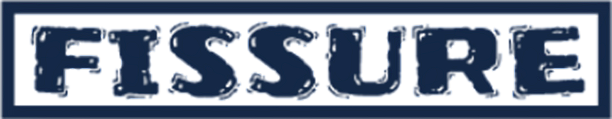

**Frequency Independent SDR-based Signal Understanding and Reverse Engineering**

## Overview Videos

<table>
  <tr>
    <td align="center" width="33%">
      <a href="https://events.gnuradio.org/event/28/contributions/859/attachments/268/696/Poore_FISSURE_Video_GRCon26.mp4">
        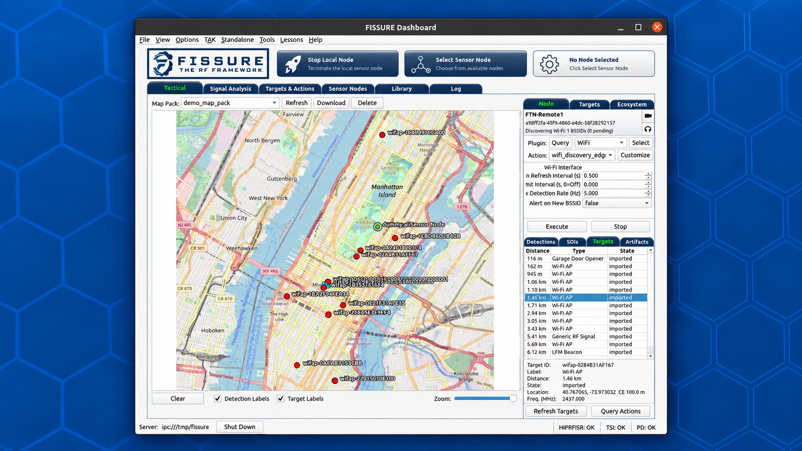
      </a>
      <br>
      <sub>Tactical Workflow Demo (GRCon26)</sub>
    </td>
    <td align="center" width="33%">
      <a href="https://events.gnuradio.org/event/28/contributions/859/attachments/268/695/Poore_FISSURE_GRCon26.pdf">
        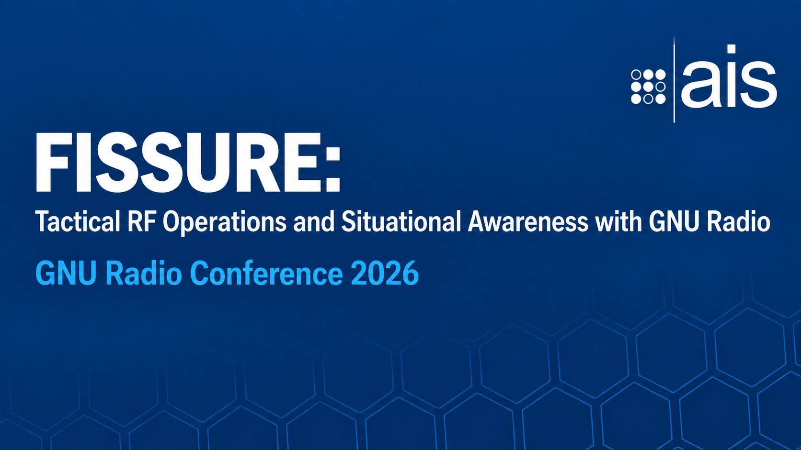
      </a>
      <br>
      <sub>GRCon26 Presentation</sub>
    </td>
    <td align="center" width="33%">
      <a href="https://youtu.be/vUJakWBVnwY">
        
      </a>
      <br>
      <sub>Operational Overview</sub>
    </td>    
  </tr>
</table>

## Introduction

FISSURE is an **open-source framework for RF analysis, automation, and distributed operations**. It connects SDR hardware, signal processing, Sensor Nodes, geolocation, protocol analysis, targeting, and situational awareness within a single extensible environment.

FISSURE can run as a standalone workstation or scale across distributed Sensor Nodes connected over IP networks. GNU Radio and other tools provide the underlying RF processing, while FISSURE coordinates hardware, data, context, plugins, Actions, and operator workflows across local and remote systems.

The framework is designed for experimentation, research, education, capability development, and operational integration without locking users to a single protocol, sensor, platform, or use case.

<p align="center">
  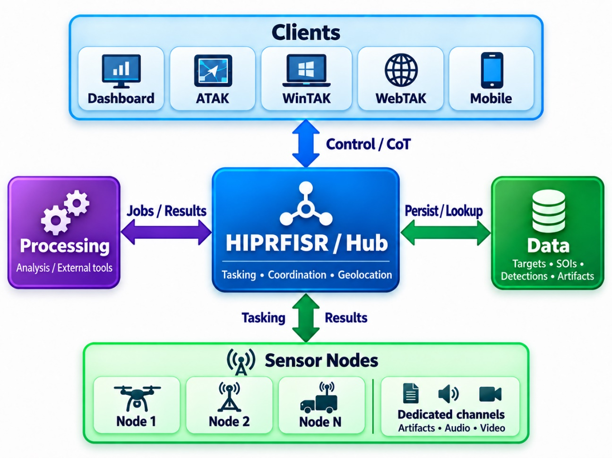
</p>

## Workflow Overview

FISSURE organizes RF workflows around connected workspaces that share Sensor Nodes, SOIs, Targets, Detections, Artifacts, Findings, and plugin Actions.

- **Tactical:** Monitor distributed Sensor Nodes, detections, SOIs, Targets, geolocation results, and other RF activity on a shared operational map.
- **Signal Analysis:** Move from survey and detection through capture, inspection, conditioning, feature extraction, classification, and protocol discovery.
- **Targets & Actions:** Manage Targets and execute reusable plugin Actions through focused, sequential, fuzzing, and packet-crafting workflows.
- **Sensor Nodes:** Configure local and remote nodes, manage hardware, transfer files, automate startup behavior, and monitor node status.
- **Library:** Maintain reusable protocol information, packet definitions, archived signals, replay content, datasets, and RF reference material.
- **Plugins & Actions:** Add, deploy, and execute capabilities across supported nodes and interfaces without modifying the FISSURE core.

<p align="center">
  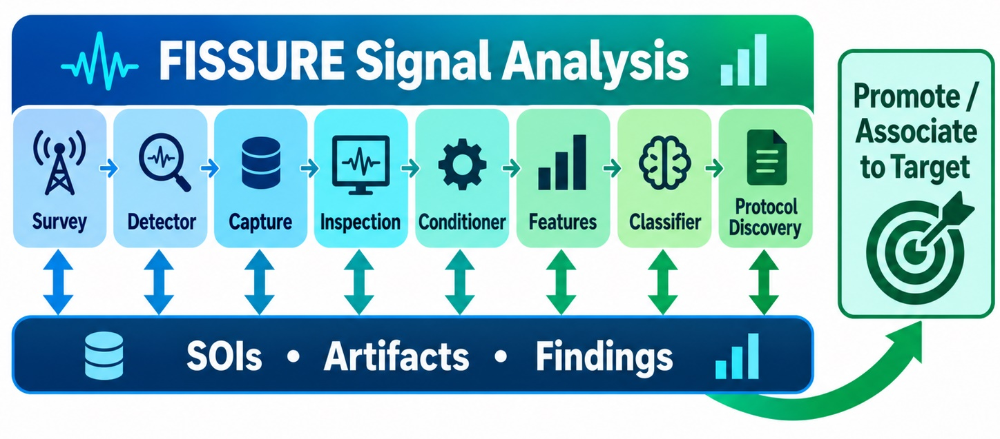
</p>

## Core Information Model

FISSURE connects workflows through a shared information model rather than treating each tool or tab as an isolated function. SOIs anchor signal analysis, Targets anchor operational context, Detections capture sensor observations, Artifacts and Findings preserve data and results, and Alerts and Action Recommendations surface information that may require attention or follow-on action.

<p align="center">
  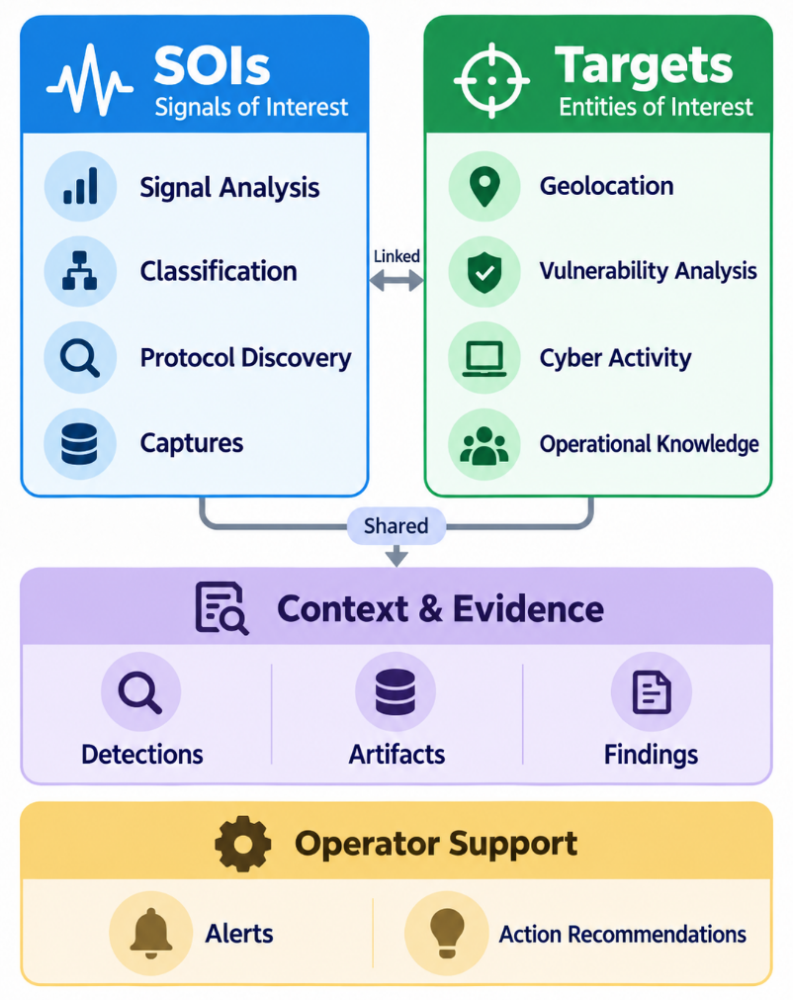
</p>

## Key Capabilities

- Detect, classify, capture, and analyze RF signals
- Record, inspect, replay, and manipulate IQ data
- Discover protocols, build packets, and perform RF/cyber experimentation
- Execute fuzzing, vulnerability analysis, and reusable test workflows
- Coordinate local and distributed Sensor Nodes, SDRs, sensors, and tools
- Geolocate emitters and maintain persistent Targets, detections, and observations
- Share RF-derived awareness, alerts, artifacts, and target information through TAK
- Extend capabilities through deployable plugins, Actions, and reusable Operations
- Automate multi-step workflows across local and remote systems
- Integrate custom analysis, external tools, and emerging AI/ML capabilities

<p align="center">
  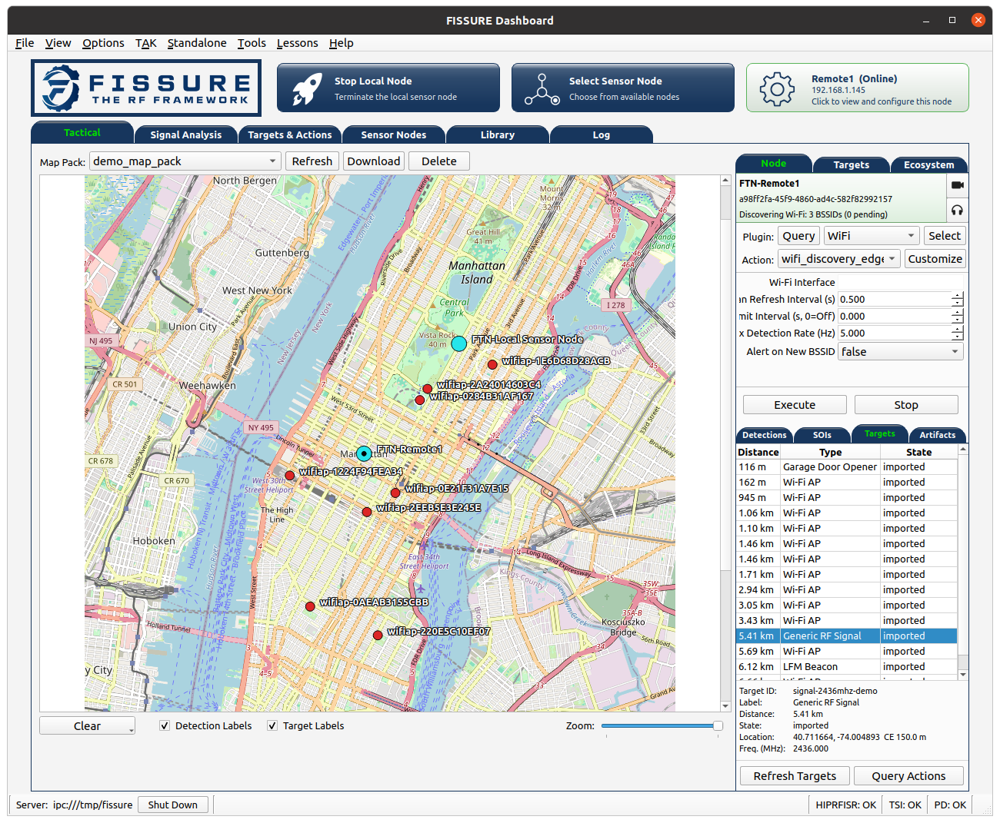
  <br>
  <sub>FISSURE Tactical view connecting distributed Sensor Nodes, detections, SOIs, Targets, and operational context.</sub>
</p>

## FISSURE and Fracture

Fracture is AIS's deployable tactical RF system built on the open-source FISSURE framework.

FISSURE provides the software foundation for RF sensing, signal analysis, distributed Sensor Nodes, geolocation, TAK integration, automation, and plugin-based capability development. Fracture packages that foundation into purpose-built hardware and software configurations designed for operational deployment.

Fracture combines SDRs, compute, networking, plugins, and mission-specific integrations around fixed-site, vehicle, manpack, sUAS, and other distributed deployments while preserving the flexibility and extensibility of FISSURE.

<p align="center">
  
</p>

### Fracture System Architecture

<p align="center">
  
</p>

## Deployment Options

FISSURE supports multiple deployment models depending on the intended workflow and operating environment:

- **Standalone Workstation:** Run the Dashboard, HIPRFISR, and a local Sensor Node on a single system for development, analysis, and experimentation.
- **Distributed Sensor Nodes:** Run RF and plugin capabilities on remote systems while coordinating tasking, results, and data through a central hub.
- **Headless Hub:** Run HIPRFISR and supporting services without the Dashboard for remote operations, TAK integration, and distributed deployments.
- **Containerized Deployment:** Use Apptainer to build repeatable Dashboard, HIPRFISR, Sensor Node, Base, Full, or custom environments.
- **TAK-Integrated Operations:** Share targets, detections, alerts, geolocation results, artifacts, and other operational information through ATAK, WinTAK, and TAK Server.

<p align="center">
  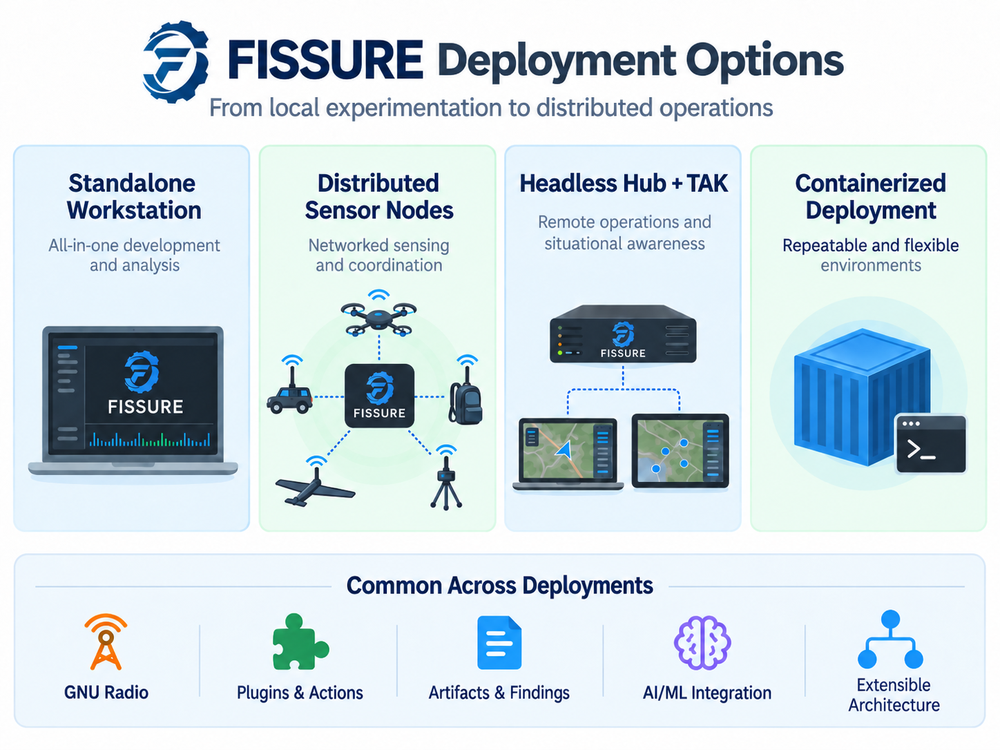
</p>

## What's New


**Connected Signal Analysis Workflows:** FISSURE now connects survey, detection, capture, inspection, conditioning, feature extraction, classification, and protocol discovery through SOI-centered workflows with associated Artifacts and Findings.


**Tactical View & Target Awareness:** The Dashboard now provides an operator-focused Tactical view for Sensor Nodes, detections, SOIs, Targets, geolocation results, and other RF activity on a shared map.


**Plugin & Action Architecture:** Capabilities can be packaged as plugins and exposed through reusable Actions and Operations for local or remote execution without modifying the FISSURE core.


**Distributed Geolocation:** Multi-node workflows support coordinated RF observations, target tracking, geolocation, and persistent operational context across distributed Sensor Nodes.


**TAK Integration:** FISSURE supports sharing Sensor Nodes, Targets, detections, geolocation results, alerts, tracks, artifacts, and other RF-derived information through TAK workflows.


**Remote RF Workflows:** GNU Radio and other graphical capabilities can run on remote Sensor Nodes while their interfaces are streamed back to the operator through Xpra.


**Apptainer Deployment:** Role-specific Apptainer environments support repeatable Dashboard, HIPRFISR, Sensor Node, Base, Full, and custom deployments.

## Who FISSURE Is For

- **Operators:** Monitor, analyze, geolocate, and respond to RF activity across local and distributed systems.
- **Researchers:** Develop and evaluate new RF, cyber, automation, AI/ML, and signal-processing techniques.
- **Educators:** Teach SDR, DSP, wireless security, protocol analysis, reverse engineering, and distributed systems.
- **Students and Hobbyists:** Explore real RF workflows using accessible hardware, open tools, and reusable examples.

## Roadmap

FISSURE continues to evolve through operational testing, research, customer needs, and community feedback.

- [View Interactive Roadmap](https://ainfosec.github.io/FISSURE/Roadmap/)  

### Current Priorities

- **End-to-End Workflows:** Connect discovery, signal analysis, targeting, actions, artifacts, findings, and sharing into clearer repeatable workflows.
- **Plugins, Actions & Operations:** Expand the plugin ecosystem across protocols, hardware, sensors, analysis, automation, and third-party integrations.
- **Distributed Deployment & Packaging:** Improve installer reliability, Apptainer support, role-specific deployments, remote Sensor Nodes, and repeatable system configuration.
- **Geolocation, Targets & TAK:** Continue improving multi-node geolocation, target awareness, operator workflows, mapping, and ATAK/WinTAK integration.
- **Automation, Provenance & AI/ML:** Strengthen traceable execution, structured context, workflow automation, and interfaces between RF data and emerging AI/ML capabilities.

## Resources & Publications

### Videos

- [FISSURE Video Playlist](https://www.youtube.com/playlist?list=PLs4a-ctXntfjpmc_hrvI0ngj4ZOe_5xm_)
- [FISSURE Overview (Slides)](https://youtu.be/Xgc8u7hLBfk)
- [AIS YouTube Channel](https://www.youtube.com/@assuredinformationsecurity/featured)

### White Papers

FISSURE is supported by a series of white papers covering technical architecture, operational use cases, deployment models, and integration topics.

1. [FISSURE Overview](/docs/White_Papers/FISSURE_Overview.pdf)
2. [FISSURE for Counter-UAS](/docs/White_Papers/FISSURE_CUAS.pdf)
3. [FISSURE for UAS Payloads & Aerial Operations](/docs/White_Papers/FISSURE_UAS_Payload_Aerial_Ops.pdf)
4. [FISSURE for Maritime](/docs/White_Papers/FISSURE_Maritime.pdf)
5. [FISSURE for Vehicle & Mobility Systems](/docs/White_Papers/FISSURE_Vehicle_Mobility_Systems.pdf)
6. [FISSURE for Perimeter & Infrastructure Defense](/docs/White_Papers/FISSURE_Perimeter_Infrastructure_Defense.pdf)
7. [FISSURE for TAK & Mobile](/docs/White_Papers/FISSURE_TAK_Mobile_Integration.pdf)
8. [FISSURE for Training & Education](/docs/White_Papers/FISSURE_Training_Education.pdf)
9. [FISSURE Technical Details & Architecture](/docs/White_Papers/FISSURE_Technical_Details_Architecture.pdf)

### Blog Posts

AIS has published several articles covering FISSURE development, demonstrations, and operational use cases:

- [Demonstrating FISSURE as a Drone Payload at Northern Strike 2025](https://www.ainfosec.com/fissure-demo-at-northern-strike)
- [A Recap of My DEF CON 2024 Presentation on FISSURE Updates](https://www.ainfosec.com/a-recap-of-my-def-con-2024-presentation-on-fissure-updates)
- [FISSURE: Navigating the Open-Source Realm](https://www.ainfosec.com/fissure-navigating-the-open-source-realm)
- [FISSURE: The RF Framework for Everyone](https://www.ainfosec.com/fissure-the-rf-framework-for-everyone)

[See all AIS blog posts](https://www.ainfosec.com/blog/)

### Upcoming and Recent Events

 **September 21-24, 2026**: GNU Radio Conference 2026 - Raleigh, NC  
[FISSURE: Tactical RF Operations and Situational Awareness with GNU Radio](https://events.gnuradio.org/event/28/contributions/859/) - Presentation slides and workflow demonstration video available on the conference page.

 **May 5-8, 2025**: SOF Week - Assured Information Security, Inc. (AIS) booth

 **September 17, 2024**: GNU Radio Conference 2024 - [Description/Slides](https://events.gnuradio.org/event/24/contributions/649/), [Live Recording](https://youtu.be/5UYhUi8SiK4?t=27282)

 **August 10, 2024**: DEF CON 32 - RF Village - [Prerecorded Video](https://www.youtube.com/watch?v=5nYiVR-PsOc), [Live Recording](https://www.youtube.com/watch?app=desktop&v=mhbJHOGrCik)

### Additional Resources

- [FISSURE Info Sheet](https://www.ainfosec.com/wp-content/uploads/2023/04/AIS-FISSURE.pdf)
- [AIS FISSURE Page](https://www.ainfosec.com/technologies/fissure/)

## Documentation

<p align="center">
  <a target="_blank" href="https://fissure.readthedocs.io/en/latest/">
    
  </a>
  <a target="_blank" href="https://fissure.readthedocs.io/en/latest/pages/installation.html">
    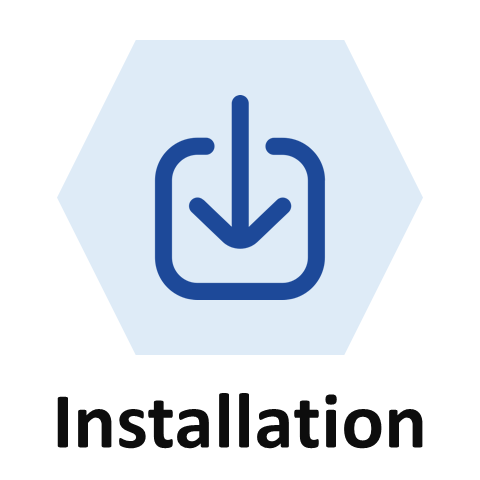
  </a>
  <a target="_blank" href="https://fissure.readthedocs.io/en/latest/pages/hardware.html">
    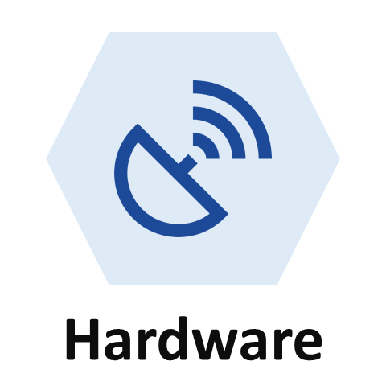
  </a>
  <a target="_blank" href="https://fissure.readthedocs.io/en/latest/pages/components.html">
    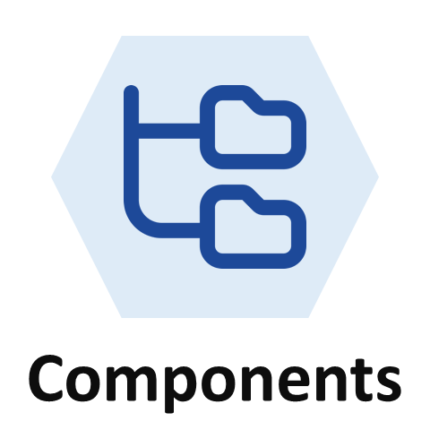
  </a>
  <a target="_blank" href="https://fissure.readthedocs.io/en/latest/pages/operation.html">
    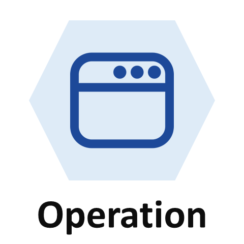
  </a>
  <a target="_blank" href="https://fissure.readthedocs.io/en/latest/pages/development.html">
    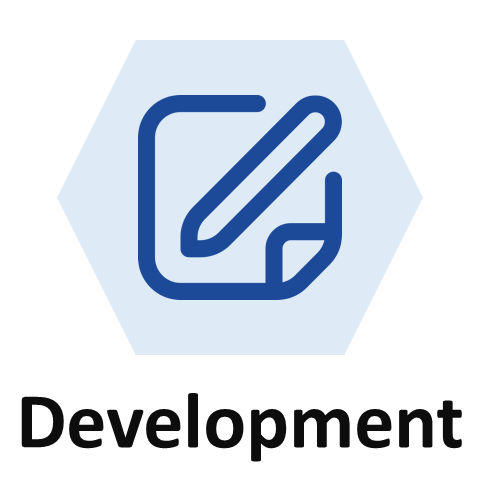
  </a>
  <a target="_blank" href="https://fissure.readthedocs.io/en/latest/pages/about.html">
    
  </a>
</p>

- [FISSURE Documentation](https://fissure.readthedocs.io/en/latest/)

## Hardware

FISSURE has integrated with a wide range of SDRs, wireless adapters, and protocol-specific RF hardware over the life of the project. Hardware support is currently being migrated into the new plugin architecture, so not every legacy integration is available through every current workflow or deployment mode yet.

Existing and previously integrated hardware includes:

### Software Defined Radios

- USRP X3xx, B2xx, B20xmini, USRP2, N2xx, X410
- HackRF
- RTL2832U
- LimeSDR
- bladeRF and bladeRF 2.0 micro
- PlutoSDR
- SDRplay RSPduo, RSPdx, RSPdx R2

### Wireless Adapters

- 802.11 adapters used for monitoring, discovery, injection, and other Wi-Fi workflows

### Protocol-Specific and Specialized Radios

- Open Sniffer
- Additional protocol-oriented radios and interfaces integrated for specific workflows

Support varies by plugin, operating system, driver availability, GNU Radio version, and individual FISSURE capability.

## Getting Started

### Supported Platforms

The `Python3` branch contains the current FISSURE codebase and supports PyQt5 with GNU Radio 3.8 and 3.10 depending on the operating system. The legacy `Python2_maint-3.7` branch is deprecated and retained only for select older tools and environments.

GitHub releases are periodic snapshots of the project and may not contain the latest fixes or features. For the most current version of FISSURE, use the `Python3` branch.

FISSURE is most extensively tested on Ubuntu and related Ubuntu-based environments.

Operating System | FISSURE Branch | Default GNU Radio Version
:-------------------------:|:-------------------------:|:-------------------------:
| DragonOS Noble (24.04) | Python3 | maint-3.10 |
| Kali | Python3 | maint-3.10 |
| Raspberry Pi OS | Python3 | maint-3.10 |
| Ubuntu 18.04 | Python2_maint-3.7 | maint-3.7 |
| Ubuntu 20.04 | Python3 | maint-3.8 |
| Ubuntu 22.04 | Python3 | maint-3.10 |
| Ubuntu 24.04 / Ubuntu ARM (Orange Pi) / Ubuntu for Raspberry Pi | Python3 | maint-3.10 |
| Windows 11 WSL2 | See Supported Linux Version | See Supported Linux Version |

### In-Progress (Beta)

The following operating systems are still being tested and may have missing functionality, installer conflicts, or unsupported third-party tools.

Operating System | FISSURE Branch | Default GNU Radio Version
:-------------------------:|:-------------------------:|:-------------------------:
| BackBox Linux | Python3 | maint-3.10 |
| KDE neon | Python3 | maint-3.10 |
| Parrot Security 6.1 | Python3 | maint-3.10 |

Some third-party tools are not available on every operating system. Refer to [Known Conflicts and Third-Party Software](https://fissure.readthedocs.io/en/latest/pages/installation.html#known-conflicts) for details.

### Apptainer Installs

FISSURE supports Apptainer-based deployment on Ubuntu 24.04 for more repeatable installation, testing, and deployment. The installer can build role-specific environments using the following modes:

- `full` - Complete FISSURE installation
- `base` - Complete standalone workstation
- `Dashboard` - Dashboard client without a local database or Sensor Node
- `HIPRFISR` - Headless hub and database services
- `SensorNode` - Remote Sensor Node execution environment
- `custom` - User-defined installer selection

Ubuntu 24.04 hosts with Ubuntu 24.04 containers are the primary tested configuration. Other host, container, and mode combinations may work but have not been fully validated.

See **Apptainer Setup** below for build and launch instructions.

### Installation

Clone FISSURE with HTTPS:

```bash
git clone https://github.com/ainfosec/FISSURE.git
cd FISSURE
git checkout Python3
./install
```

For contributors using SSH:

```bash
ssh-keygen -t ed25519
cat ~/.ssh/id_ed25519.pub
```

Add the public key to GitHub under **Settings > SSH and GPG keys**, then clone with:

```bash
git clone git@github.com:ainfosec/FISSURE.git
cd FISSURE
git checkout Python3
./install
```

The installer will detect the operating system when possible and prompt for any required PyQt dependencies and optional third-party software.

After installation, reboot or log out and back in so that user group and device permission changes take effect.

### Installer Notes

FISSURE is easiest to install on a clean operating system to reduce conflicts with existing packages and third-party software.

- Run the installer and FISSURE from a user-owned directory such as your home directory. Do not run `./install` or `fissure` with `sudo`.
- The installer will automatically detect the operating system when possible and select the closest supported configuration.
- Choose the installation mode that matches the intended role:
  - `Full` for the broadest installation
  - `Base` for a complete standalone workstation
  - `Dashboard`, `HIPRFISR`, or `Sensor Node` for role-specific systems
  - `Custom` for a user-defined selection
- Radio drivers, out-of-tree modules, and optional third-party tools can be installed as needed for the desired hardware and workflows.
- Some installer items are unchecked by default because they may be unsupported, conflict with other software, or require additional setup.
- Items with a Verify step are checked after installation and highlighted based on whether the verification command succeeds.
- GNU Radio flow graphs may need to be recompiled when moving between GNU Radio versions.
- Third-party software is generally downloaded to and installed from `~/Installed_by_FISSURE`.
- Make sure the system clock is correct before installing to avoid package repository errors.

<p align="center">
  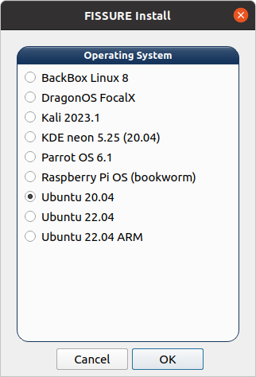
  <br>
  <sub>Select the operating system and installation mode.</sub>
</p>

<p align="center">
  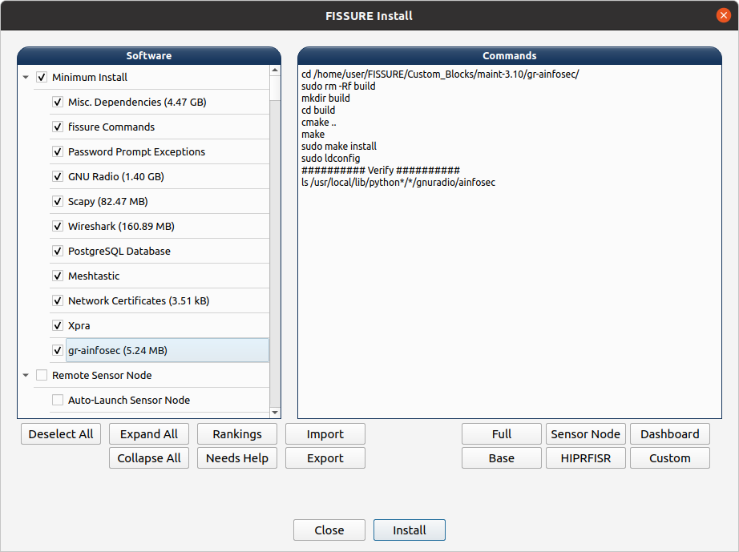
  <br>
  <sub>Select software, hardware support, optional components, and review the installation commands.</sub>
</p>

### Remote Sensor Node Installation

Install FISSURE on the remote system using the normal installation process. For now, install FISSURE in the same directory location on both the local and remote systems to avoid filepath issues with certain Actions.

Configure the remote Sensor Node in:

`./YAML/Sensor_Node_Config/default.yaml`

Update the following fields:

- `nickname` - Use a unique name other than `Local Sensor Node`
- `hiprfisr_ip_address` - IP address of the HIPRFISR / Hub
- `hardware` - Configure the hardware available on the node
- `autorun` - Set to `true` to automatically launch the default Autorun playlist when the Sensor Node starts

Autorun provides unattended execution of saved plugin Action sequences without requiring the Dashboard to remain connected. Playlists can include per-Action timing and optional detector gating.

#### Certificates

Remote Sensor Nodes use certificates generated during installation to authenticate with the client.

The Sensor Node requires:

- `server.key_secret`
- `client.key`

The client requires:

- `client.key_secret`
- `server.key`

If the certificate directory was generated on the Sensor Node, copy the required client files to the Dashboard system before connecting.

### Local Dashboard Usage

After installation, open a new terminal and launch FISSURE with:

```bash
fissure
```

Run FISSURE as your normal user, not with `sudo`. Launching from a terminal is recommended because it provides useful status and diagnostic output.

A local Sensor Node can be started from the top controls in the Dashboard, allowing a single workstation to run the Dashboard, HIPRFISR, and Sensor Node together.

FISSURE no longer enforces a fixed Sensor Node count. Deployments can scale to the number of remote Sensor Nodes supported by the available compute, network, and operational workload.

If FISSURE does not close cleanly, the following command will stop the remaining FISSURE processes:

```bash
sudo pkill python3 && sudo pkill -9 -f fissure
```

For troubleshooting or more targeted process control:

```bash
sudo ps -aux | grep fissure
sudo pkill python3
sudo kill -9 <PID of __main__.py>
```

### Headless Hub

The HIPRFISR can run without the Dashboard GUI for distributed deployments, TAK integration, remote Sensor Node coordination, and other headless workflows.

Launch the hub with:

```bash
fissure-hiprfisr
```

The hub will start its configured services, connect to TAK when enabled, and accept connections from remote Sensor Nodes without requiring the Dashboard to remain open.

### Remote Sensor Node Usage

After configuring the Sensor Node, launch it from a terminal with:

```bash
fissure-sensor-node
```

The Sensor Node will connect to the configured HIPRFISR / Hub and remain active until `Ctrl+C` is applied.

Once connected, the node will appear in FISSURE and can be selected and tasked through the Dashboard and supported workflows. Multiple remote Sensor Nodes can be connected simultaneously, with individual workflows determining whether operations run on a single node or coordinate across multiple nodes.

### Windows 11 WSL2 Instructions

FISSURE can run in Windows 11 using WSL2 for supported Linux operating systems. Expand the sections below for setup and troubleshooting commands.

<details>
<summary><strong>Install WSL2</strong></summary>

1. Open PowerShell as Administrator.

2. Install WSL:

```powershell
wsl --install
```

3. Enable virtualization in BIOS and verify it in **Task Manager > Performance > CPU > Virtualization**.

4. Set WSL2 as the default version:

```powershell
wsl --set-default-version 2
```

5. List available Linux distributions:

```powershell
wsl --list --online
```

6. Install a supported Ubuntu distribution. For example:

```powershell
wsl --install -d Ubuntu-24.04
```

7. Open the Start Menu, search for Ubuntu, and launch it.

8. To uninstall a distribution:

```powershell
wsl --unregister Ubuntu-24.04
```

</details>

<details>
<summary><strong>Enable USB Passthrough</strong></summary>

1. Open PowerShell as Administrator and install `usbipd`:

```powershell
winget install usbipd
```

2. Add `usbipd` to the Windows System PATH:

```text
C:\Program Files\usbipd-win
```

Use **Start Menu > Environment Variables > Edit the system environment variables > System Properties > Environment Variables > System Variables > Path > Edit > New**.

3. Close and reopen PowerShell as Administrator.

4. List available USB devices:

```powershell
usbipd wsl list
```

5. Attach a USB device using its BUS ID:

```powershell
usbipd wsl attach --busid <BUS_ID>
```

Or attach it to a specific WSL distribution:

```powershell
usbipd wsl attach --busid <BUS_ID> --wsl <DistributionName>
```

6. To detach the device:

```powershell
usbipd wsl detach --busid <BUS_ID>
```

</details>

<details>
<summary><strong>Install FISSURE in WSL</strong></summary>

Install Git:

```bash
sudo apt-get install git
```

Then clone FISSURE and install it using the normal installation instructions above.

</details>

### TAK Setup

FISSURE can connect to a local or remote TAK Server for sharing Sensor Nodes, Targets, detections, geolocation results, alerts, tracks, artifacts, data packages, video connections, and other operational information.

TAK settings are configured in:

```text
FISSURE/YAML/User Configs/default.yaml
```

For current builds, use `auto` when TAK connectivity is desired or `disabled` when TAK should remain disconnected.

<details>
<summary><strong>TAK Configuration Fields</strong></summary>

The relevant settings are under the `tak:` section:

```yaml
tak:
  cert: /path/to/takserver.pem
  connect_mode: disabled
  ip_addr: localhost
  external_ip: 192.168.1.128
  key: /path/to/takserver.key
  port: 8089
  tak_on_startup: false
  webadmin_cert: /path/to/webadmin.p12
```

- `ip_addr` - The TAK Server address used directly by HIPRFISR. FISSURE uses this address for the TLS CoT connection on `port` and for TAK Server HTTPS data-package uploads on port `8443`. Use `localhost` when TAK Server is running on the same system as HIPRFISR, or the reachable TAK Server IP address/hostname for a remote server.
- `external_ip` - The address advertised to TAK clients when FISSURE creates resources that must be reached from another system. It is currently used in TAK data-package download URLs and as the fallback advertised host for video originating from a local Sensor Node. In a typical local TAK deployment, set this to the FISSURE/TAK host address reachable by ATAK, WinTAK, and other clients.
- `port` - The TAK TLS CoT port used by PyTAK. The default is `8089`. The TAK HTTPS API used for data packages uses port `8443` separately.
- `connect_mode` - Controls whether HIPRFISR starts its TAK client. Use `auto` to connect at startup and automatically reconnect after an outage. Use `disabled` to leave TAK disconnected.
- `tak_on_startup` - When `true`, HIPRFISR attempts to start locally installed TAK Server Docker database and server containers during startup. Leave this `false` when using a remote TAK Server or when managing the local containers separately.
- `cert` - Certificate path passed to PyTAK as its TLS CA/trust file.
- `key` - Private key path passed to PyTAK for the TLS CoT connection.
- `webadmin_cert` - Client certificate used by the current TAK integration. FISSURE also reads this PKCS#12 (`.p12`) file when authenticating HTTPS data-package uploads to the TAK Server.

> **Note:** The configuration still contains a `manual` connection mode, but the current Dashboard does not provide a complete manual-connect workflow. Use `auto` or `disabled` for current deployments.

</details>

<details>
<summary><strong>Local TAK Server</strong></summary>

1. Register and download the TAK Server Docker `.zip` from [tak.gov](https://tak.gov/products/tak-server).

2. Create the FISSURE third-party software directory if it does not already exist:

```bash
mkdir -p ~/Installed_by_FISSURE
```

3. Place the downloaded TAK Server `.zip` file in:

```text
~/Installed_by_FISSURE
```

4. Run the **TAK Server** item in the FISSURE installer.

5. For local WebTAK access, import the generated Web Admin certificate into the browser:

```text
~/Installed_by_FISSURE/takserver-docker-#.#-RELEASE-##/tak/certs/files/webadmin.p12
```

6. Configure the TAK settings in:

```text
FISSURE/YAML/User Configs/default.yaml
```

For a TAK Server running on the same system as HIPRFISR:

```yaml
tak:
  ip_addr: localhost
  external_ip: <FISSURE_TAK_HOST_IP_REACHABLE_BY_CLIENTS>
  port: 8089
  connect_mode: auto
  tak_on_startup: true
```

`ip_addr: localhost` keeps HIPRFISR's connection local. Set `external_ip` to the LAN, VPN, or other address that ATAK, WinTAK, and other TAK clients can actually reach.

7. If you do not want HIPRFISR to start the TAK Docker containers automatically, use:

```yaml
tak:
  tak_on_startup: false
```

The containers can also be started manually from the FISSURE Dashboard:

```text
TAK > Start Docker Containers
```

8. Open WebTAK from the FISSURE **TAK** menu and verify that the map loads.

9. Run a FISSURE Action or workflow that generates TAK output to verify the connection.

</details>

<details>
<summary><strong>Remote TAK Server</strong></summary>

1. Configure the remote TAK Server in:

```text
FISSURE/YAML/User Configs/default.yaml
```

For example:

```yaml
tak:
  ip_addr: <REMOTE_TAK_SERVER_IP_OR_HOSTNAME>
  external_ip: <TAK_SERVER_ADDRESS_REACHABLE_BY_CLIENTS>
  port: 8089
  connect_mode: auto
  tak_on_startup: false
```

`ip_addr` is the address HIPRFISR uses to reach the TAK Server. `external_ip` is the address placed into client-facing TAK resource URLs and may be the same address or a different externally reachable address.

2. Update the TAK certificate paths in the same `tak:` section:

```yaml
tak:
  cert: /path/to/takserver.pem
  key: /path/to/takserver.key
  webadmin_cert: /path/to/webadmin.p12
```

3. Leave local TAK container startup disabled:

```yaml
tak:
  tak_on_startup: false
```

4. Run a FISSURE Action or workflow that generates TAK output to verify the connection.

</details>

### Apptainer Setup

Apptainer can be used to containerize most of the FISSURE software environment for more repeatable installation, testing, and deployment.

Several components still remain on the host system:

- Docker containers, including PostgreSQL and TAK Server
- Apptainer itself
- udev rules and device permissions
- Hardware drivers and other host-level interfaces required for SDRs, Wi-Fi adapters, and peripherals

Ubuntu 24.04 hosts with Ubuntu 24.04 containers are the primary tested configuration. Prebuilt Apptainer containers and ISO images are planned for future releases.

<details>
<summary><strong>Build an Apptainer Environment</strong></summary>

1. Clone FISSURE using the normal installation instructions above.

2. Open the Apptainer installer script:

```text
FISSURE/Installer/install_apptainer.sh
```

3. Review the configuration variables near the top of the script and enable or disable the desired hardware and software options.

4. Choose the desired FISSURE installation mode:

- `full` - Complete FISSURE installation with supported SDR software, network tools, and utilities
- `base` - Complete standalone workstation capable of running the Dashboard, HIPRFISR, and a local Sensor Node
- `Dashboard` - Dashboard client without a local database or Sensor Node
- `HIPRFISR` - Headless HIPRFISR hub with database services
- `SensorNode` - Remote Sensor Node runtime with supported hardware, GNU Radio modules, and compiled flow graphs
- `custom` - User-defined installer selection configured in `Installer/Modes/custom.py`

5. Run the installer:

```bash
cd FISSURE/Installer
./install_apptainer.sh
```

The installer builds a writable Apptainer sandbox in the user's home directory and installs the selected software inside the container and on the host where required.

</details>

<details>
<summary><strong>Launch and Run FISSURE</strong></summary>

Launch the configured Apptainer environment with:

```bash
fissure-apptainer
```

This opens a shell inside the FISSURE container with graphics, audio, udev information, and hardware device access configured by the launcher.

Once inside the container, run FISSURE normally:

```bash
fissure
```

For a remote Sensor Node environment:

```bash
fissure-sensor-node
```

</details>

<details>
<summary><strong>Troubleshooting Information</strong></summary>

When reporting an Apptainer issue, include:

- Host operating system
- Apptainer version
- Selected FISSURE install mode
- Affected hardware
- Relevant installer or launch output

Because some drivers, Docker services, permissions, and hardware interfaces remain on the host, problems may originate either inside the container or from the host configuration.

</details>

## Lessons

FISSURE includes hands-on lessons for learning RF, SDR, protocol analysis, supporting tools, and related technologies. Many lessons use software and workflows that are integrated directly into FISSURE.

- [Lesson 1: OpenBTS](/docs/Lessons/Markdown/Lesson1_OpenBTS.md)
- [Lesson 2: Lua Dissectors](/docs/Lessons/Markdown/Lesson2_LuaDissectors.md)
- [Lesson 3: Sound eXchange](/docs/Lessons/Markdown/Lesson3_Sound_eXchange.md)
- [Lesson 4: ESP Boards](/docs/Lessons/Markdown/Lesson4_ESP_Boards.md)
- [Lesson 5: Radiosonde Tracking](/docs/Lessons/Markdown/Lesson5_Radiosonde_Tracking.md)
- [Lesson 6: RFID](/docs/Lessons/Markdown/Lesson6_RFID.md)
- [Lesson 7: Data Types](/docs/Lessons/Markdown/Lesson7_Data_Types.md)
- [Lesson 8: Custom GNU Radio Blocks](/docs/Lessons/Markdown/Lesson8_Custom_GNU_Radio_Blocks.md)
- [Lesson 9: TPMS](/docs/Lessons/Markdown/Lesson9_TPMS.md)
- [Lesson 10: Ham Radio Exams](/docs/Lessons/Markdown/Lesson10_Ham_Radio_Exams.md)
- [Lesson 11: Wi-Fi Tools](/docs/Lessons/Markdown/Lesson11_WiFi_Tools.md)
- [Lesson 12: Creating Bootable USBs](/docs/Lessons/Markdown/Lesson12_Creating_Bootable_USBs.md)
- [Lesson 13: Z-Wave](/docs/Lessons/Markdown/Lesson13_Z-Wave.md)
- [Lesson 14: Ceiling Fans](/docs/Lessons/Markdown/Lesson14_Ceiling_Fans.md)

## FISSURE Challenge

The **FISSURE Challenge** is temporarily offline while the challenge environment, hosting, and content are being updated.

The challenge was created as a hands-on environment for practicing RF reverse engineering, protocol analysis, and FISSURE workflows. Challenge content and solution walkthroughs will continue to be updated as the environment is refreshed.

- [Challenge Solution Walkthroughs](https://www.youtube.com/watch?v=jYtqWwG_-kI)

## Developing with AI

FISSURE is structured to work well with AI-assisted development because capabilities are increasingly separated into plugins, Actions, Operations, UI components, and reusable framework services.

For larger changes, the easiest approach is usually to zip the relevant project directories and upload the archive directly to the AI tool. This gives it enough context to understand the surrounding structure, follow existing patterns, and make changes that fit the rest of the codebase.

Useful directories to include are:

- `fissure/` - Core application code, services, callbacks, and shared framework logic
- `Plugins/` - Plugin Actions, Operations, schemas, setup logic, and examples
- `UI/` - Dashboard UI files, widgets, and styling
- `YAML/` - Configuration, library data, and supporting definitions

For smaller changes, zip only the affected files and directories plus one or two nearby working examples.

FISSURE is also moving toward richer, structured Artifacts that preserve signal context, parameters, results, provenance, and supporting data. The goal is to make useful outputs easier to copy or provide directly to AI tools for analysis without manually reconstructing the surrounding context.

When adding new capabilities, prefer extending the plugin, Action, and Operation architecture instead of modifying the FISSURE core unless the capability requires framework-level changes.

## Contributing

Contributions to FISSURE are strongly encouraged. Useful contribution areas include:

- New plugins, Actions, and Operations
- RF protocols and signal analysis methods
- SDR and hardware support
- GNU Radio flow graphs
- Python analysis tools
- Installer and packaging fixes
- Third-party tool integrations
- Lessons, tutorials, and documentation
- Testing, bug reports, and workflow improvements

Good places to start a discussion are the [GitHub Discussions](https://github.com/ainfosec/FISSURE/discussions) page, the Discord server, email, or a focused [GitHub Issue](https://github.com/ainfosec/FISSURE/issues).

For code contributions:

1. Fork the project.
2. Create a feature branch:

```bash
git checkout -b feature/AmazingFeature
```

3. Commit your changes:

```bash
git commit -m 'Add some AmazingFeature'
```

4. Push the branch:

```bash
git push origin feature/AmazingFeature
```

5. Open a pull request.

For additional ideas, see the project roadmap and the running list of potential [to-do items](./TODO.md).

## Student Projects and Classroom Use

FISSURE is well suited for senior projects, undergraduate and graduate research, RF/cybersecurity courses, capstone work, and open-source software assignments.

Potential project areas include:

- SDR and hardware integration
- RF protocol analysis and reverse engineering
- Signal detection and classification
- IQ capture, inspection, and analysis
- Plugin, Action, and Operation development
- Geolocation and distributed sensing
- TAK integration and situational awareness
- Visualization and operator workflows
- Lessons, tutorials, and documentation

Students, instructors, research groups, and organizations interested in using FISSURE for hands-on RF, SDR, cybersecurity, or reverse engineering work are encouraged to reach out.

## Testimonials

> “FISSURE is a powerful and versatile RF software platform suitable for both education and practical applications. It supports a wide range of commonly used hardware and offers intuitive IQ data analysis tools. These features enable us to visualize, interpret, and directly modify RF signal messages in our project.”  
> – Dylan R.

> “We really enjoyed using FISSURE in our engineering project. This software is an incredibly comprehensive collection of tools to manipulate radio frequencies and was an amazing aid to our studies involving wireless communications.”  
> – University Senior Project Team

## Commercial Support and Collaboration

Assured Information Security, Inc. (AIS) provides commercial support, integration, and capability development for organizations using FISSURE and Fracture.

AIS can support:

- Integration of FISSURE into existing platforms, networks, and workflows
- Development of custom plugins, Actions, Operations, and protocol-specific capabilities
- Support for new SDRs, sensors, hardware, and communications systems
- TAK integration and distributed Sensor Node architectures
- RF sensing, geolocation, signal analysis, and electronic warfare workflows
- Mission-specific software and operator interfaces
- Fracture hardware and deployment configurations
- Training, testing, field evaluation, and long-term sustainment

Fracture provides a path for organizations that need supported, deployable systems built around FISSURE. Configurations can be tailored for fixed-site, vehicle, manpack, sUAS, fixed-wing, and other distributed deployments.

Whether the goal is research, prototyping, operational integration, or development of a mission-specific capability, AIS can help adapt the FISSURE framework to the intended environment while preserving its flexibility and extensibility.

For commercial inquiries, contact AIS Business Development at `bd@ainfosec.com`.

## License

FISSURE is released under the GNU General Public License v3.0 (GPL-3.0).

See the [LICENSE](./LICENSE) file for the full license terms.

## Contact

For questions, collaboration, support, or project discussion:

- **Discord:** [Join the FISSURE Discord Server](https://discord.gg/JZDs5sgxcG)
- **LinkedIn:** [FISSURE - The RF Framework](https://www.linkedin.com/company/fissure-the-rf-framework)
- **Bluesky:** [@fissurerf.bsky.social](https://bsky.app/profile/fissurerf.bsky.social)
- **Twitter/X:** [@FissureRF](https://twitter.com/fissurerf) and [@AinfoSec](https://twitter.com/ainfosec)
- **FISSURE Contact:** Chris Poore - `poorec@ainfosec.com`
- **Commercial / Business Development:** `bd@ainfosec.com`

## Acknowledgments

Special thanks to Dr. Samuel Mantravadi and Joseph Reith for their contributions to FISSURE.

<p align="center">
  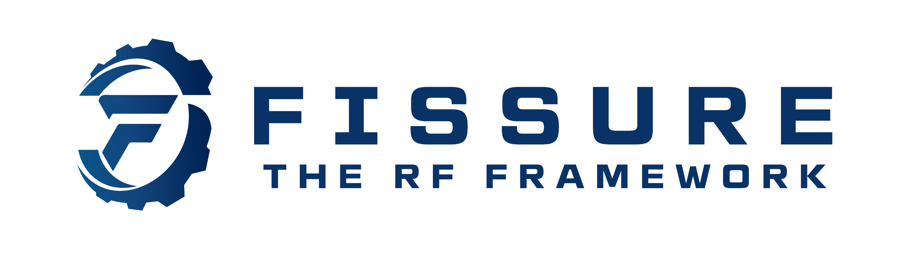
</p>

## Assured Information Security

FISSURE is developed and maintained by [Assured Information Security, Inc. (AIS)](https://www.ainfosec.com/).

Explore other AIS open-source projects at:

- [ainfosec.dev](https://ainfosec.dev/)

Interested in signals, reverse engineering, cybersecurity, or related work?

- [View AIS Career Openings](https://recruiting.paylocity.com/recruiting/jobs/All/4cc515ee-a8ad-4e3a-ac7d-c105c5d24074/ASSURED-INFORMATION-SECURITY-INC)
- [Join the AIS Talent Community](https://recruiting.paylocity.com/Recruiting/PublicLeads/New/4cc515ee-a8ad-4e3a-ac7d-c105c5d24074)
- [Try the Can You Hack It?® Challenge](https://www.canyouhackit.com)

<p align="center">
  <a href="https://www.ainfosec.com/">
    
  </a>
</p>
