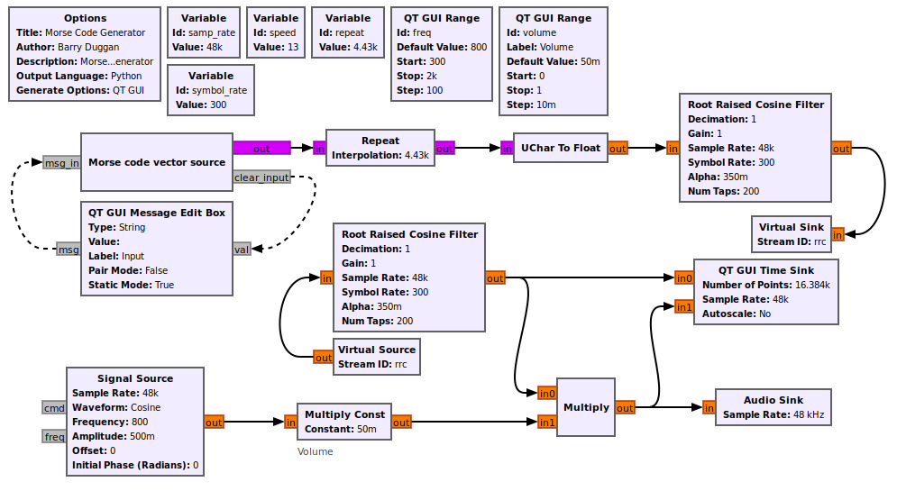
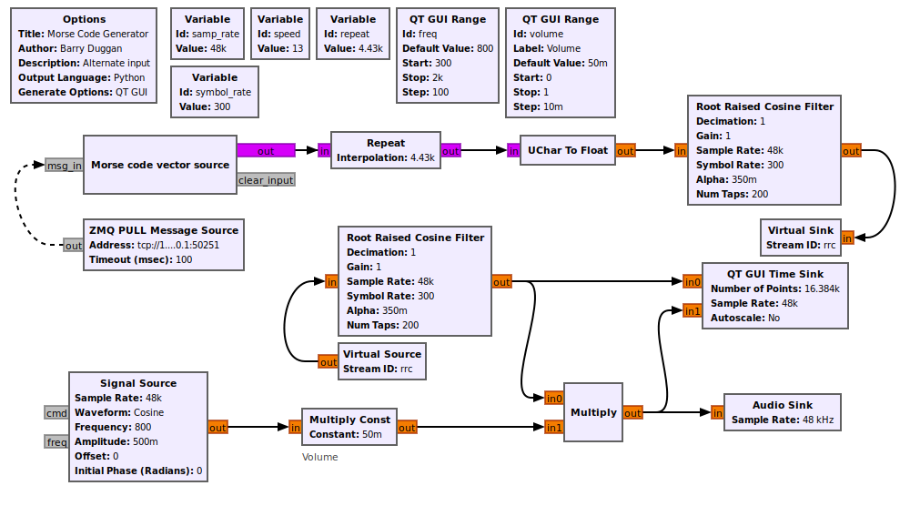
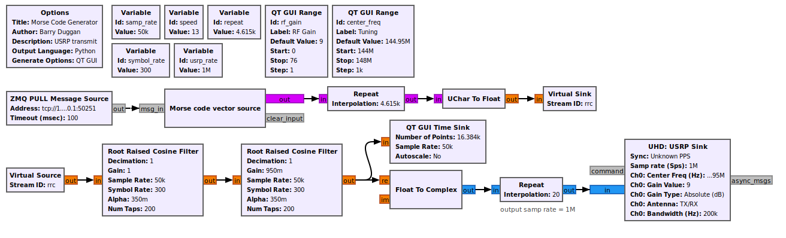

# gr-morse-code-gen
This program generates Morse code from keyboard input. The audio output can be fed to a Single Sideband (SSB) transmitter to generate a CW signal. An alternative presented later can key an SDR hardware device directly.

These flowgraphs were developed with GNU Radio version 3.8.1.0, and have been tested on version 3.9.0.0 as well.

If you have GNU Radio version 3.7, you can recreate the flowgraph and copy the `epy_block_0_0.py` file into an Embedded Python block to create the "Morse code vector source" block.

## Versions

* v1.0.0.0
  * The initial release had a simple low-pass filter and used a speed setting method which limited it to factors of 48.
* Master (current version)
  * waveform shaping is done with a Raised Cosine Filter
  * speed can be set to anything from 1 to 48 wpm.

---



## Table of Contents

[Installation](#install)  
[Setting parameters](#params)  
[Operation](#ops)  
[Alternate input method](#alternate)  
[Transmit with SDR Hardware](#transmit)

<a name="install"/>

## Installation

See [What is GNU Radio?](https://wiki.gnuradio.org/index.php/What_is_GNU_Radio%3F) and [Installing GNU Radio](https://wiki.gnuradio.org/index.php/InstallingGR) for background information.

Note: These instructions are written for a Linux OS. Similar commands work for Mac and Windows.

1. Open a terminal window.
2. Change to the home directory.  
```
cd ~/  
```
3. If you don't have 'git', enter  
```
sudo apt install git  
```
4. Clone the repository:  
```
git clone https://github.com/duggabe/gr-morse-code-gen.git
```
5. **If** you want to use version 1, enter  
```
git checkout v1.0.0.0
```

<a name="params"/>

## Setting parameters

There are four variable boxes in the flowgraph:  

```samp_rate```, ```speed```, ```repeat```, and ```symbol_rate```.

* The ```speed``` variable in words per minute can be set to integer from 1 to 48 wpm. 

* ```repeat``` is computed from the ```speed```.

* The ```symbol_rate``` determines the keying pulse shape. A value of 300 gives good rise and fall times.

**Note:** The Audio Sink Device Name is dependent on the Operating System and the desired output port. See [Audio Sink](https://wiki.gnuradio.org/index.php/Audio_Sink) for additional information.

<a name="ops"/>

## Operation

### Using gnuradio-companion

1. Open a terminal window.
2. Go to the gr-morse-code-gen folder.  
```
cd ~/gr-morse-code-gen
```
3. Execute Gnu Radio Companion.  
```
gnuradio-companion
```
4. Open MorseGen.grc from the file menu.
5. Set the ```speed``` to the desired rate.
6. Click 'Run' and 'Execute' or press F6.
7. A new window titled "Morse Code Generator" will open showing a frequency slider, a volume control, and a text input line.
8. Highlight the text input line.
9. Type a line of text to be sent and press 'Enter'. That line will be sent as Morse code.
10. Continue with additional text to be sent. Note that corrections can be made to the line of text before pressing 'Enter'. There is no need to stop execution of the program when switching from transmit to receive mode.
11. To Terminate the program, click the 'x' in the corner of the title line.

### Command line operation

Each time you run the program from gnuradio-companion, a new version of the MorseGen.py file is created. So if you don't need to change the speed from what you used last, you can start the program as follows:

1. Open a terminal window.
2. Go to the gr-morse-code-gen folder.  
```
cd ~/gr-morse-code-gen
```
3. Enter ```python3 MorseGen.py```
4. A new window titled "Morse Code Generator" will open showing a frequency slider, a volume control, and a text input line.
5. Highlight the text input line.
6. Type a line of text to be sent and press 'Enter'. That line will be sent as Morse code.
7. Continue with additional text to be sent. Note that corrections can be made to the line of text before pressing 'Enter'. There is no need to stop execution of the program when switching from transmit to receive mode.
8. To Terminate the program, click the 'x' in the corner of the title line.

<a name="alternate"/>

## Alternate input method

An alternate input method is provided by using ```MorseGen_alt.grc``` and ```MorseGen_alt.py``` in the instructions above. It uses a ZMQ message socket instead of the Message Edit Box.



To use this method, do the following. Note that you are using two separate terminal screens.

1. Start MorseGen_alt.
2. Go to [gr-webserver](https://github.com/duggabe/gr-webserver) and follow the instructions to install it **using a separate terminal screen**.
3. Start the gr-webserver. Whatever you type not only will be sent as Morse Code, but will be displayed on the screen. The most recent 20 lines will be displayed.

<a name="transmit"/>

## Transmit with SDR Hardware

The flowgraph below produces Morse code which keys an SDR hardware device directly.



Other SDR hardware devices can be used, such as an ADALM-Pluto.


## Credits

Thanks to Ron Economos (w6rz) for the revised shaping filters and speed setting.  
Thanks to Volker Schroer (dl1ksv) for the coding to use the Message Edit block as the input device.

